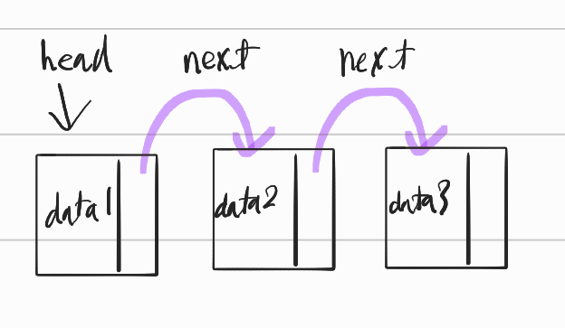

# list
## 1. 구조
```cpp
strcut node{
    T data;
    node* next;
}
node* head;
```
  
위의 사각형 하나가 노드 1개이고  
next를 통해 다음 사각형으로 이동하는 자료구조이다  

시간복잡도  

## 2. 연산
### 2.1 삽입
### 2.2 삭제
#### 2.2.1 andvanced 삭제
### 2.3 리스트끼리 연결
